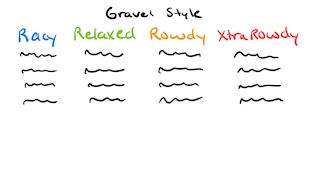
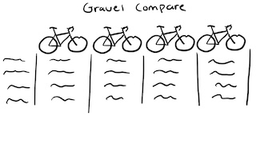
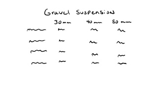
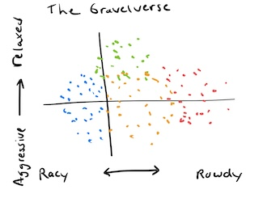
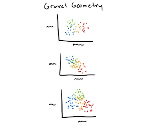
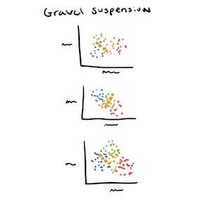

```{r setup-index, echo=FALSE, warning=FALSE, message=FALSE}
source_path <- here::here("bike_geometry_project.R")
source(source_path)
```

Current number of bike models in the database: `r length(unique(geobike[, model]))`!

::: {layout-ncol=3 fig-align="center"}

[](qmd/gravel_class.html)

[](qmd/gravel_compare.html)

[](qmd/gravel_sus_table.html)

[](qmd/gravelverse.html)

[](qmd/gravel_scatter.html)

[](qmd/gravel_sus_scatter.html)

:::

copyright 2022-2025
